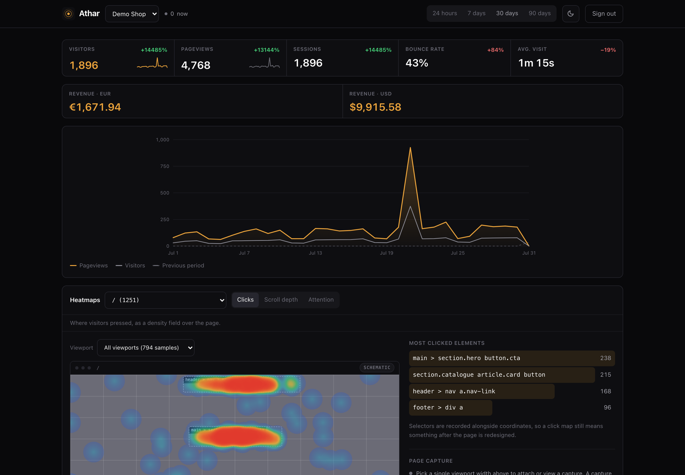
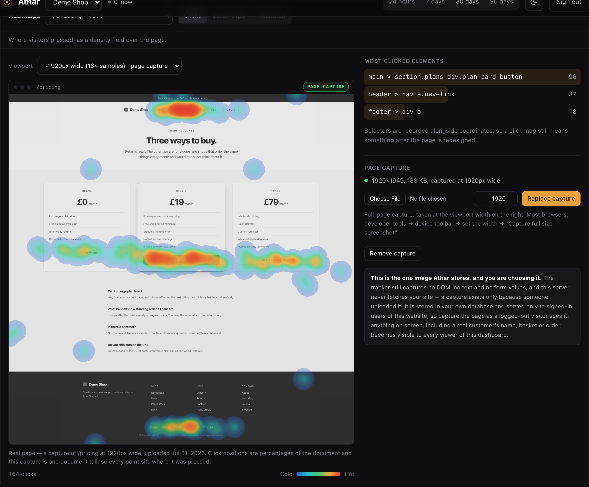
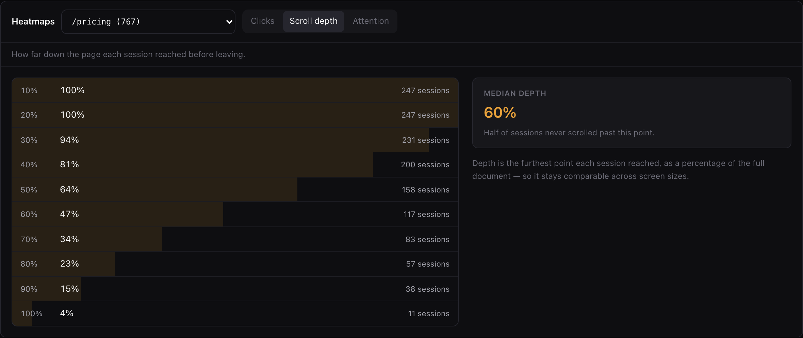
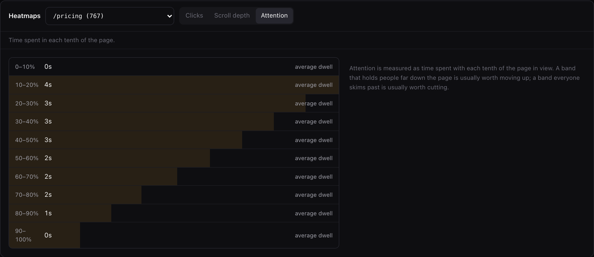
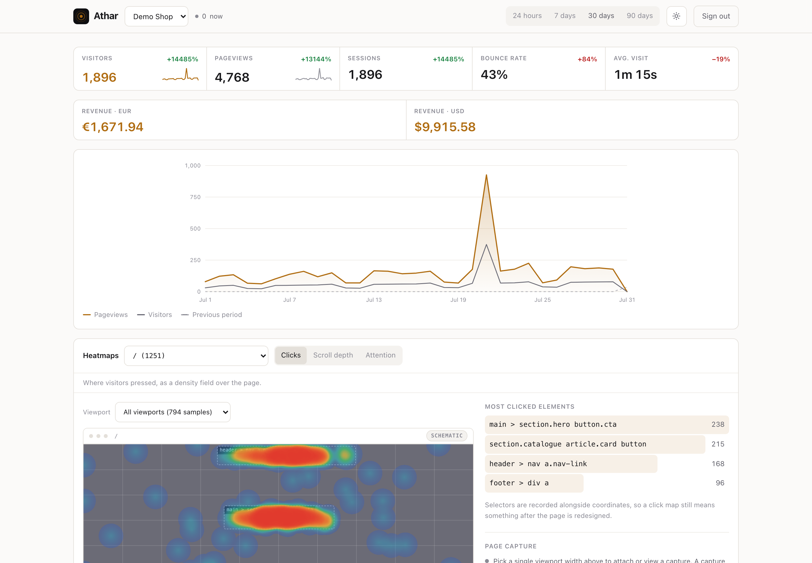
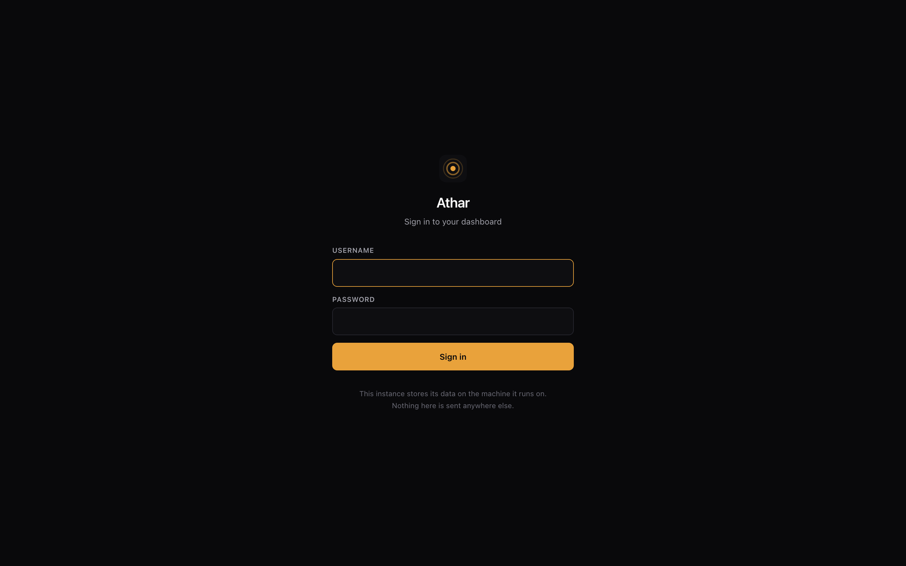
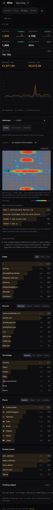

<div align="center">


# ATHAR

<sub>**أثر — trace / impact**</sub>

***Analytics where the data never leaves your server.***<br>
**Self-hosted web analytics with heatmaps and ecommerce tooling, in a single Go binary.**<br>
**Cookieless by construction. SQLite or Postgres, your choice, same binary.**

[](LICENSE-MIT)
[](https://github.com/vul-os/athar/releases)
[](https://github.com/vul-os/athar/actions)
[](https://golang.org)

*Vulos — rooted in **vula**, the Zulu and Xhosa word for **open**.*



</div>

---

> **Status: v0.1.0, early.** The core collector, storage, auth and reporting
> paths are implemented and have been exercised end to end, but this is a
> young project — expect rough edges, and expect the API surface to move
> before 1.0. See [ROADMAP.md](ROADMAP.md) for what's shipped versus what's
> still ahead, and [CHANGELOG.md](CHANGELOG.md) for version history.

---

## Overview

Athar is a single static Go binary that serves a full web analytics stack —
collector, dashboard, and REST API — with no external services and no
outbound calls. Point a `<script>` tag at it, and it counts pageviews,
sessions, referrers and revenue, renders click/scroll/attention heatmaps, and
resolves visitor geography from a local database file, all on infrastructure
you control. Nothing about a pageview is ever sent to a third party, because
there is no third party in the loop: the binary you run *is* the whole
service.

The name is Arabic أثر — "trace" and "impact" at once, which is roughly what
an analytics tool is for.

[GitHub](https://github.com/vul-os/athar) · [Quick start](#quick-start) · [Docs](#documentation) · [Changelog](CHANGELOG.md) · [Roadmap](ROADMAP.md)

---

## Screenshots

<table>
<tr>
<td colspan="2"><br><em><strong>Click heatmap</strong> — density over a real capture of the page (an editor's own upload, badged "Page capture"), with the most-clicked elements listed as selectors so the map still means something after a redesign. No capture uploaded yet? The map falls back to a wireframe schematic, badged as one — see <a href="#heatmap-page-captures">Heatmap page captures</a></em></td>
</tr>
<tr>
<td><br><em>Scroll depth — how far people actually get</em></td>
<td><br><em>Attention — where they linger rather than skim</em></td>
</tr>
<tr>
<td><br><em>Dashboard, dark</em></td>
<td><br><em>…and light. Follows your system by default.</em></td>
</tr>
<tr>
<td><br><em>First run — create the only account on your instance</em></td>
<td><br><em>Responsive down to a phone screen — no separate app to install</em></td>
</tr>
</table>

> These are generated, not staged. `npm run screenshots` builds the binary,
> generates 30 days of backdated demo traffic, boots the server against a
> throwaway database, and drives a real browser — failing if the dashboard logs
> a single console error. Re-run it after any UI change.

---

## Why Athar

Self-hosted analytics is not a new idea, but the existing options each give
up something Athar doesn't:

| | Licence | Weight | Heatmaps | Ecommerce | Built-in GeoIP |
|---|---|---|---|---|---|
| **Athar** | MIT OR Apache-2.0 | Single Go binary, no daemon | ✅ click / scroll / attention | ✅ revenue events, multi-currency | ✅ local `.mmdb`, no network call |
| [Umami](https://umami.is) | MIT | Light (Node/Next.js + Postgres or MySQL) | ❌ | ❌ | ❌ |
| [Plausible](https://plausible.io) (Community Edition) | AGPL-3.0 | Light (Elixir + ClickHouse) | ❌ | ❌ | Optional, self-configured |
| [Matomo](https://matomo.org) | GPL-3.0+ | Heavy (PHP + MySQL) | 💰 paid plugin | ✅ | ✅ (plugin) |
| [PostHog](https://posthog.com) | Mostly MIT, some proprietary enterprise features | Heavy (ClickHouse + Kafka + Redis) | ✅ (toolbar heatmaps) | Not the focus | ❌ |

A few things worth being precise about, in fairness to the table above:
Umami and Ackee are genuinely MIT and genuinely light, but they stop at
pageview counting — no heatmaps at all. PostHog is the most feature-complete
of the group, but it's a product-analytics platform first (feature flags,
session replay, experiments) built on a multi-service data stack, and
ecommerce is not its focus. Matomo has real, mature ecommerce tracking, but
its heatmap and session-recording feature lives behind a paid plugin on top
of the GPL core. Plausible, GoatCounter and OpenReplay are copyleft (AGPL,
GPL, EUPL) — a licence class many businesses avoid embedding in their own
product for reasons that have nothing to do with code quality.

**MIT-or-Apache-licensed, lightweight, with heatmaps, ecommerce tooling, and
built-in GeoIP in one binary** is the specific combination that was missing.
That's the gap Athar fills.

---

## Deployment modes

Athar is one self-hosted binary that runs a few different ways — every shape
on infrastructure you control:

- **Standalone self-host (SQLite)** — the default. `./athar` on a home
  server, a NAS, or a small VPS: zero setup, storage is one file
  (`athar.db`), loopback-bound by default.
- **Hosted / cloud (Postgres)** — the same binary against a `postgres://`
  DSN for a managed or pooled deployment. Nothing above the storage layer
  changes; see [docs/DEPLOYMENT-POSTGRES.md](docs/DEPLOYMENT-POSTGRES.md).
- **Behind a tunnel or reverse proxy** — Athar binds loopback by default and
  is meant to be reached through [cloudflared](https://github.com/cloudflare/cloudflared),
  [ngrok](https://ngrok.com), your own [Ephor](https://github.com/vul-os/ephor)
  server, or a conventional reverse proxy (nginx, Caddy) terminating TLS in
  front of it. See [docs/SELF-HOSTING.md](docs/SELF-HOSTING.md).
- **Embedded behind an iframe host** — set `frame_ancestors` so a host shell
  (e.g. the Vulos OS) can embed the Athar dashboard as an app tile behind its
  own routing and auth.

The dashboard is deliberately not a desktop or installable app: the
collector is a server process that has to stay running to receive beacons,
so packaging the dashboard as something you close when you close your laptop
would invite the wrong mental model. It's a plain web page — hand-written
HTML/CSS/JS, no framework — that you open in a browser tab from any device
wherever it's reachable, while the actual collector keeps running
independently of whether that tab is open.

---

## Features

| Feature | Description |
|---------|-------------|
| **Cookieless tracking** | No cookie is set or read, nothing is written to storage. Visitor identity is a daily, per-site, salted server-side hash — see [Privacy architecture](#privacy-architecture). |
| **Automatic pageviews + SPA routing** | Tracks page loads and, via `pushState`/`replaceState`/`popstate` hooks, client-side route changes in React/Vue/etc. apps. |
| **Custom & revenue events** | `athar.track(name, data)` for arbitrary events; `athar.revenue(amount, currency, orderId, name)` for ecommerce, stored as integer minor units per currency. |
| **Heatmaps** | Click, scroll-depth and attention (dwell-time-by-band) sampling, positioned as page-relative percentages with a CSS selector — survives layout and viewport changes. The tracker itself captures no DOM snapshot, no keystrokes, no page content, ever. An editor can optionally upload a picture of the page (per page, per viewport width) for the click map to render over; with none uploaded, it falls back to a wireframe schematic reconstructed from recorded selectors. See [Heatmap page captures](#heatmap-page-captures). |
| **Reporting** | Pageviews, unique visitors, sessions, bounce rate, average visit time; top pages, entry/exit pages, referrers, UTM campaigns; browser/OS/device/screen/language; country/region/city; custom events; realtime active-visitor count; per-currency revenue totals. |
| **In-process GeoIP** | Resolves country/region/city from a local MaxMind-format `.mmdb` (DB-IP Lite or GeoLite2). No network call, no service, no database bundled — bring your own file. |
| **Bot filtering** | Recognised bot traffic is dropped at ingest rather than recorded. |
| **Public share links** | An unguessable id serves read-only summary stats for one website, no login required. Re-enabling sharing mints a fresh id, so disabling it is a real revocation. **API-only in 0.1.0** — mint or revoke a link with `POST /api/websites/{id}/share`; there is no toggle in the dashboard yet ([ROADMAP.md](ROADMAP.md#near-term)). |
| **Auth** | argon2id password hashing, server-side sessions (only a token hash is stored), httpOnly + `SameSite=Lax` cookies, double-submit CSRF on every state-changing route, login rate limiting keyed on username *and* client address. |
| **Roles** | Per-website owner / editor / viewer, layered on instance-wide admin / user roles. |
| **Retention** | Optional automatic deletion of whole visitor sessions (cascading to their events, heatmap samples and revenue) past a configured age. |
| **Multiple websites** | Track any number of properties from one instance, one dashboard. Adding a site is a dashboard action; deleting one is API-only in 0.1.0 (`DELETE /api/websites/{id}`). |
| **REST API** | Every report the dashboard shows is a documented JSON endpoint. |
| **Dashboard** | Hand-written HTML/CSS/JS embedded straight into the Go binary — no framework, no separate build step, dark mode by default. |
| **Single binary, either database** | SQLite (pure Go, no cgo) or Postgres, chosen by one config value — the "Store seam"; see [docs/ARCHITECTURE.md](docs/ARCHITECTURE.md). |
| **Small tracker** | 3.3 KB raw, 1.6 KB gzipped. `?source=1` serves the readable original so anyone can verify what a site is running. |

---

## Quick start

Requires Go 1.25+ to build from source. Node.js 22+ is only needed if you
also want to rebuild the tracker from source or embed the marketing site
(see below) — the dashboard itself has no build step.

```bash
git clone https://github.com/vul-os/athar.git
cd athar
go build -o athar ./backend/cmd/athar   # dashboard + tracker embedded, no Node needed
./athar
```

For a release build that also rebuilds the tracker and embeds the marketing
mini-site, use `npm run build` instead (requires Node.js 22+; outputs
`./athar`).

That's it — `./athar` with no flags listens on `127.0.0.1:3100` and stores to
`./athar.db` in the current directory. Open [http://localhost:3100](http://localhost:3100)
and follow the first-run setup screen to create the initial admin account
(first-run bootstrap only works while the instance has zero users).

Then add the tracker to a site:

```html
<script defer src="https://your-athar-host/athar.js"
        data-website-id="YOUR_WEBSITE_ID"></script>
```

See [Deployment modes](#deployment-modes) for reaching Athar from outside
`localhost`, and [docs/GETTING-STARTED.md](docs/GETTING-STARTED.md) for the
full walkthrough.

### Development

```bash
go run ./backend/cmd/athar         # Go backend + dashboard on :3100
```

There is no separate frontend dev server: the dashboard is hand-written
HTML/CSS and plain ES modules (`backend/internal/webui/static/`), embedded
via `go:embed`. Edit those files directly, then re-run the command above —
Ctrl-C and restart to pick up the change, since `go:embed` reads the files
at compile time.

```bash
make check     # gofmt, go build/vet/test, tracker-up-to-date check, dashboard JS tests (node --test)
```

See [CONTRIBUTING.md](CONTRIBUTING.md) for the full dev workflow.

---

## How the tracker works

One `<script>` tag is the whole client-side integration:

```html
<script defer src="https://your-athar-host/athar.js"
        data-website-id="YOUR_WEBSITE_ID"
        data-heatmap="true"></script>
```

| Attribute | Default | Description |
|---|---|---|
| `data-website-id` | *(required)* | The website id from your Athar dashboard. |
| `data-host-url` | script's own origin | Send beacons somewhere other than where the script is hosted. |
| `data-domains` | *(none)* | Comma-separated hostname allowlist — the script no-ops outside it. |
| `data-auto-track` | `true` | Set `"false"` to disable automatic pageviews and track manually. |
| `data-heatmap` | `false` | Set `"true"` to collect click / scroll / attention samples. |
| `data-do-not-track` | `false` | Set `"true"` to honour the browser's Do Not Track signal. |
| `data-exclude-search` | `false` | Set `"true"` to drop query strings from tracked URLs. |

Once loaded, `window.athar` exposes:

```js
athar.track()                                   // manual pageview
athar.track('signup_started')                   // custom event
athar.track('signup_started', { plan: 'pro' })  // …with properties
athar.revenue(49.99, 'USD', 'order_123', 'purchase')  // revenue event
```

Beacons are sent with `navigator.sendBeacon` (so the final flush on page
unload actually arrives), falling back to `fetch` with `keepalive`. The
collector answers every request — including malformed ones and beacons for
an unknown website id — with the same `204 No Content`, so a broken
integration never surfaces an error in a visitor's console and a probing
request can't be used to enumerate valid website ids.

The script is served from a configurable path (`/athar.js` by default —
renaming it is the standard way to survive a content blocker that matches on
filename) with a stable ETag and a 4-hour cache; `?source=1` always serves
the current binary's readable, commented source, so anyone can check exactly
what a site they're visiting is running.

---

## Heatmap page captures

The click heatmap can render over a real picture of the page. That picture
is **operator-supplied upload, not automatic capture** — the tracker never
changed to make this work, and still records only an x/y position
(as a percentage of the *document*, not the viewport), the viewport size,
and a short CSS selector per click. No DOM, no HTML, no text, no form
values, and the server never fetches the tracked site to render one itself.

From the dashboard, an editor or owner takes a full-page screenshot of a
page (most browsers: developer tools → device toolbar → set the width →
"Capture full size screenshot") and uploads it against that page's path and
the viewport width it was taken at. There is one capture per (website, path,
viewport width) — re-uploading replaces it — and it's served back only to
signed-in users of that website, with a restrictive
`Content-Security-Policy` and an ETag. The stored format is decided by
decoding the uploaded bytes, never by a claimed `Content-Type`.

**Why upload rather than capture automatically?** Two alternatives were
considered and rejected — see
[`backend/internal/api/pageimages.go`](backend/internal/api/pageimages.go)
for the full reasoning:

- A tracker-side DOM snapshot would upload the page *as a visitor saw it* —
  including their name, their basket, their order — and sanitising that
  reliably is a permanent, adversarial maintenance burden. Athar's tracker
  captures no page content at all; that's a promise, not a gap to route
  around.
- Server-side rasterisation would need a headless browser next to a binary
  whose whole distribution story is "one static Go binary, no cgo, no
  daemons," would only work for pages the server can reach, and would turn
  the analytics server into a thing that makes outbound requests to
  operator-named URLs — an SSRF surface where there was none.

**Because the capture is something you choose to upload, what's in it is
your call.** It's stored in your own database and shown only to signed-in
users of that website's dashboard — but anything visible in it becomes
visible to *every* one of them. The dashboard says this at the moment of
upload: capture the page as a logged-out visitor sees it, not a page with a
real customer's name, basket or order on screen.

**Without a matching capture, the map falls back to a wireframe schematic**
— the bounding box of every selector's own recorded clicks, badged
`SCHEMATIC` and captioned "not a picture of the page" — never a stale or
mismatched image borrowed from another page or viewport. "All viewports"
always shows the schematic too: averaging a 390px layout and a 1440px one
onto a single picture would be exactly the authoritative-looking lie this
feature exists to avoid.

---

## Privacy architecture

This is the part of Athar worth reading closely, because it's a specific
construction, not a marketing claim.

**No cookie is ever set.** The tracker (`backend/internal/tracker/athar.js`)
never writes a cookie, never reads one, and never touches `localStorage` or
`sessionStorage`. There is nothing on the visitor's device to consent to and
nothing for a visitor to carry between sites.

**Visitor identity is computed, not stored, per request:**

```
salt    = HMAC-SHA256(instance_secret, "YYYY-MM-DD")
visitor = HMAC-SHA256(salt, website_id ‖ 0x00 ‖ ip ‖ 0x00 ‖ user_agent)
```

- `instance_secret` is 32 random bytes generated on first run and persisted
  in the database, so a restart doesn't re-count every returning visitor as
  new.
- `salt` is recomputed once per UTC day. Because the salt for July 24th
  cannot be derived from the salt for July 23rd (both come from an HMAC of
  the long-lived secret, not from each other), a visitor hash from one day
  cannot be linked to that same visitor's hash from another day. Cross-day
  tracking isn't merely unimplemented — it is not *derivable* from what
  Athar stores. Deleting the instance secret permanently severs the link to
  every previous day's hashes, which is the intended way to hard-reset
  visitor identity instance-wide.
- The **website id is inside the hash**, so the same person browsing two
  different sites on one Athar instance produces two unrelated hashes. One
  operator running several properties cannot build a cross-site profile out
  of their own database — the data model doesn't allow it, independent of
  policy.
- The **raw IP address is used for exactly two things** — this hash, and the
  GeoIP lookup below — and then it is discarded. It is never written to the
  database, never logged, and never appears in an error message. Only the
  resulting hex-encoded hash is stored, in the `visits.visitor_hash` column.

**GeoIP is resolved in-process**, from a local MaxMind-format `.mmdb` file
(DB-IP Lite or GeoLite2) memory-mapped by a pure-Go reader — no service call,
no network round trip, no dependency on a third party learning your
visitors' IPs to tell you their country. Only `country` (ISO 3166-1
alpha-2), `region`, and `city` names are stored; coordinates are never read
from the database, let alone persisted. No database is bundled with Athar —
it's tens of megabytes and carries its own redistribution terms — so this is
opt-in: without one configured, Athar collects everything else and simply
leaves the location fields empty.

**Bot traffic is dropped, not recorded**, at ingest.

For the full threat model — what an operator can and cannot learn from their
own database, and what someone who steals a copy of it can and cannot
recover — see [docs/PRIVACY.md](docs/PRIVACY.md).

---

## Configuration

Athar needs no configuration to run: `./athar` alone works, storing to
`./athar.db` on loopback. An optional `athar.config.json` is searched for in
the working directory and its parents, then `~/.config/athar/`, then next to
the binary. Precedence, lowest to highest: built-in defaults → config file →
`ATHAR_*` environment variables → CLI flags.

| Key | Env | Flag | Default | Description |
|---|---|---|---|---|
| `host` | `ATHAR_HOST` | `--host` | `127.0.0.1` | Bind address. Loopback only by default — see [docs/SELF-HOSTING.md](docs/SELF-HOSTING.md) for reaching it from outside. |
| `port` | `ATHAR_PORT` | `--port` | `3100` | HTTP port. |
| `database` | `ATHAR_DATABASE` | `--db` | `athar.db` | Store DSN. A bare path (or `sqlite://path`) is SQLite; a `postgres://…` URL is Postgres. |
| `geoip_path` | `ATHAR_GEOIP_PATH` | `--geoip` | *(unset)* | Path to a MaxMind `.mmdb` file. Unset disables geo resolution. |
| `tracker_path` | `ATHAR_TRACKER_PATH` | — | `/athar.js` | URL the tracker script is served from. |
| `collect_path` | `ATHAR_COLLECT_PATH` | — | `/api/send` | URL beacons are POSTed to. |
| `session_window` | `ATHAR_SESSION_WINDOW` | — | `30m` | Idle gap before the next pageview starts a new visitor session. |
| `session_ttl` | `ATHAR_SESSION_TTL` | — | `24h` | Idle lifetime of a *dashboard login* session. |
| `retention_days` | `ATHAR_RETENTION_DAYS` | — | `0` (forever) | Delete whole visitor sessions older than N days. |
| `trust_proxy_headers` | `ATHAR_TRUST_PROXY_HEADERS` | — | `false` | Read the client IP from `X-Forwarded-For`/`X-Real-IP` instead of the socket peer. **Off by default on purpose** — see [docs/SELF-HOSTING.md](docs/SELF-HOSTING.md#trust_proxy_headers). |
| `frame_ancestors` | `ATHAR_FRAME_ANCESTORS` | — | `""` | CSP allow-list for embedding the dashboard in an iframe. Empty blocks all cross-origin framing. |
| `serve_landing` | `ATHAR_SERVE_LANDING` | — | `false` | Serve the marketing mini-site at `/` and `/site/*`. Off by default — a self-hosted instance should open straight into the dashboard. |
| `disable_signup` | `ATHAR_DISABLE_SIGNUP` | — | `false` | Blocks the first-run admin bootstrap explicitly (bootstrap already only ever works on an empty instance). |
| — | — | `--secure-cookies` | `false` | Mark session cookies `Secure`. Set this once Athar is reached over HTTPS. |
| — | — | `--version` | — | Print the version and exit. |

Unknown keys in `athar.config.json` are a hard startup error, so a typo in a
security-relevant key like `trust_proxy_headers` fails loudly instead of
being silently ignored. Full reference: [docs/CONFIGURATION.md](docs/CONFIGURATION.md).

---

## Deployment

**SQLite (default, self-host)** — `./athar` with no `database` set stores to
`athar.db` next to wherever you run it. No daemon, no separate service, WAL
mode so the dashboard can query while the collector writes.

**Postgres (cloud / managed)** — set `database` to a `postgres://…` DSN, or
pass `--db postgres://…`. Same binary, same schema, same API — the Store
seam is what makes this a config change instead of a fork. See
[docs/DEPLOYMENT-POSTGRES.md](docs/DEPLOYMENT-POSTGRES.md).

**Reaching Athar from the internet** — it binds `127.0.0.1` by default, so a
collector endpoint that must receive beacons from the public internet still
starts out unreachable from anywhere but the box it's on. The intended path
is a tunnel (cloudflared, ngrok, your own Ephor server) or a reverse
proxy in front of it — both reach loopback without ever binding Athar itself
to `0.0.0.0`. See [docs/SELF-HOSTING.md](docs/SELF-HOSTING.md).

---

## Security

Athar's auth is fail-closed throughout: an unparseable session or a missing
CSRF token is rejected, not passed through. Highlights — full detail in
[SECURITY.md](SECURITY.md):

- **Passwords**: argon2id, 64 MiB memory, parameters embedded in the stored
  hash so raising them later doesn't invalidate existing accounts.
- **Sessions**: server-side, identified by a SHA-256 of the token — reading
  the database never yields a usable session — httpOnly + `SameSite=Lax`
  cookies, sliding expiry.
- **CSRF**: double-submit token, checked by the auth middleware itself on
  every state-changing method, so a new route is protected by virtue of
  being mounted behind it rather than by remembering to add a check.
- **Login rate limiting**: keyed on username *and* client address, so
  neither a targeted lockout attack nor a credential-stuffing spray across
  many accounts gets a free pass.
- **Share links**: resolved strictly from the share id in the URL, never
  from a caller-supplied website id — a share link cannot be pivoted into
  another site's data.
- **The collector** is unauthenticated by necessity (it receives beacons
  from anonymous visitors) and is rate-limited per source address, body-size
  bounded, and answers every outcome — success, malformed input, unknown
  website id — with the same `204`, so it can't be used as an oracle.

Please report vulnerabilities privately — see [SECURITY.md](SECURITY.md) for
where and what's especially in scope.

---

## Documentation

| Document | Description |
|---|---|
| [docs/GETTING-STARTED.md](docs/GETTING-STARTED.md) | Installation, first-run setup, adding a site |
| [docs/ARCHITECTURE.md](docs/ARCHITECTURE.md) | The Store seam, the ingest path, the embed/build-tag pattern, why the dashboard is hand-written JS with no build step |
| [docs/CONFIGURATION.md](docs/CONFIGURATION.md) | Every config key, env var and flag |
| [docs/PRIVACY.md](docs/PRIVACY.md) | The hashing construction's threat model — what's recoverable and what isn't |
| [docs/SELF-HOSTING.md](docs/SELF-HOSTING.md) | Tunnels, reverse proxies, `trust_proxy_headers`, HTTPS |
| [docs/DEPLOYMENT-POSTGRES.md](docs/DEPLOYMENT-POSTGRES.md) | Running Athar against Postgres |
| [ROADMAP.md](ROADMAP.md) | What's shipped, what's next |
| [CHANGELOG.md](CHANGELOG.md) | Full version history |

---

## Contributing

Contributions are welcome — see [CONTRIBUTING.md](CONTRIBUTING.md) for dev
setup, branch/PR conventions, and the list of frozen invariants (no cgo, no
frontend build step for the dashboard, nothing that phones home, no raw IP
at rest, no cookies from the tracker).

1. Fork the repository
2. Create a feature branch: `git checkout -b feat/my-feature`
3. Commit your changes: `git commit -m 'feat: add my feature'`
4. Push to the branch: `git push origin feat/my-feature`
5. Open a pull request

Please keep `make check` clean before submitting.

---

## Licence

[MIT](LICENSE-MIT) OR [Apache-2.0](LICENSE-APACHE) — © Vulos. Athar is a
Vulos project; source and issues at [github.com/vul-os/athar](https://github.com/vul-os/athar).

### Third-party notices

Athar redistributes third-party software one way: Go modules compiled into
the binary (`modernc.org/sqlite`, `pgx`, `maxminddb-golang`,
`golang.org/x/crypto` and their transitive dependencies). The dashboard is
hand-written HTML/CSS/JS with zero third-party code, and package.json's only
dependencies are devDependencies (esbuild for the tracker build, Playwright
for screenshots/tests) that never ship in the binary. These Go modules'
licences (MIT, BSD, ISC, Apache-2.0, MPL-2.0) require the copyright notice
and licence text to accompany every copy.

[THIRD-PARTY-NOTICES.txt](THIRD-PARTY-NOTICES.txt) has the name, version,
licence and full text for every component — generated from the real
dependency graph by `make notices` (`scripts/gen-notices.sh`); never
hand-edited.

---

<div align="center">

<a href="https://github.com/vul-os/athar">GitHub</a> · <a href="https://github.com/vul-os/athar/issues">Issues</a> · <a href="https://github.com/vul-os/athar/releases">Releases</a>

<br>

<sub>Athar is a free, open-source, self-hosted web analytics tool with heatmaps and ecommerce tracking.<br>
Built as a privacy-respecting alternative to Google Analytics — and to hosted self-host tools that stop at pageviews.<br>
Keywords: self-hosted analytics, cookieless analytics, privacy-first analytics, website heatmaps,<br>
ecommerce analytics, GDPR-friendly analytics, single binary analytics, open source analytics, Go web analytics.</sub>

</div>

## Brand

The mark in [`brand/`](brand/) is the source of truth. Every icon this repo
ships — the mark in the README and the site's favicon — is rendered from
`brand/logo.svg` rather than redrawn, so there is one approved drawing and no
second copy to drift. (The dashboard PWA icons and its own favicon were
removed along with the PWA itself — see [CHANGELOG.md](CHANGELOG.md) — and
the embedded dashboard currently ships no favicon of its own; flagged for
whoever owns `backend/internal/webui` next.)

Copy it outward, never edit a derived copy, and never edit `brand/` to match
something downstream.

---

<p align="center">
  <a href="https://vulos.org"></a><br>
  <sub><a href="https://vulos.org"><b>vulos</b></a> — open by design</sub>
</p>
